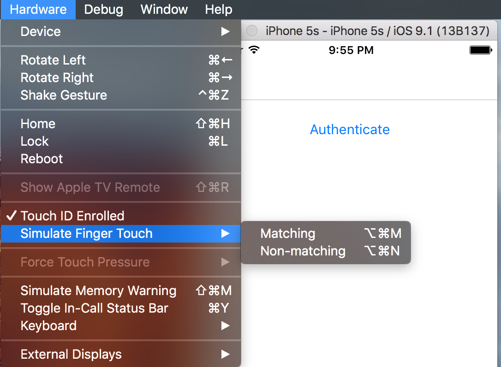

#  Xamarin Fingerprint
Xamarin and MvvMCross plugin for accessing the fingerprint sensor

It is available via NuGet: TODO

## Usage
### API
The API is defined by the ```IFingerprint``` interface:

```csharp
/// <summary>
/// Checks the availability of fingerprint authentication.
/// Possible Reasons for unavailability:
/// - Device has no sensor
/// - OS does not support this functionality
/// - Fingerprint is not enrolled
/// </summary>
bool IsAvailable { get; }

/// <summary>
/// Requests the authentication.
/// </summary>
/// <param name="reason">Reason for the fingerprint authentication request. Displayed to the user.</param>
/// <returns>Authentication result</returns>
Task<FingerprintAuthenticationResult> AuthenticateAsync(string reason);

/// <summary>
/// Requests the authentication (cancelable).
/// </summary>
/// <see cref="AuthenticateAsync(string)"/>
Task<FingerprintAuthenticationResult> AuthenticateAsync(string reason, CancellationToken cancellationToken);
```

The returned ```FingerprintAuthenticationResult``` contains information about the authentication.
```csharp
/// <summary>
/// Indicatates whether the authentication was successful or not.
/// </summary>
public bool Authenticated { get { return Status == FingerprintAuthenticationResultStatus.Succeeded; } }

/// <summary>
/// Detailed information of the authentication.
/// </summary>
public FingerprintAuthenticationResultStatus Status { get; set; }

/// <summary>
/// Reason for the unsucessful authentication.
/// </summary>
public string ErrorMessage { get; set; }

```

### Example
#### vanilla
```csharp
var result = await Fingerprint.Current.AuthenticateAsync("Prove you have fingers!");
if (result.Authenticated)
{
    // do secret stuff :)
}
else
{
    // not allowed to do secret stuff :(
}
```

#### using MvvMCross
```csharp
var fpService = Mvx.Resolve<IFingerprint>(); // or use dependency injection and inject IFingerprint

var result = await fpService.AuthenticateAsync("Prove you have mvx fingers!");
if (result.Authenticated)
{
    // do secret stuff :)
}
else
{
    // not allowed to do secret stuff :(
}
```

### iOS
Nothing special on iOS. You can't configure anything and the standard iOS Dialog will be shown.

### Android
#### Setup
TODO
#### Configuration
TODO

## Testing on Simulators
### iOS


With the Hardware menu you can
* Toggle the enrollment status
* Trigger valid (<kbd>⌘</kbd> <kbd>⌥</kbd> <kbd>M</kbd>) and invalid (<kbd>⌘</kbd> <kbd>⌥</kbd> <kbd>N</kbd>) fingerprint sensor events

### Android
* start the emulator (Android >= 6.0)
* open the settings app
* go to Security > Fingerprint, then follow the enrollment instructions
* when it asks for touch
 * open command prompt
 * `telnet 127.0.0.1 <emulator-id>` (`adb devices` prints "emulator-&lt;emulator-id&gt;")
 * `finger touch 1`
 * `finger touch 1`

Sending fingerprint sensor events for testing the plugin can be done with the telnet commands, too.

**Note for Windows users:**
You have to enable telnet: Programs and Features > Add Windows Feature > Telnet Client


